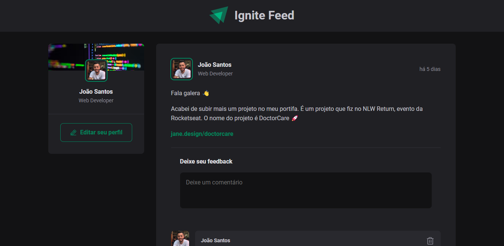

<h1 align="center">
  Ignite Feed 💬
</h1>

  

  <a href="#-tecnologias">Tecnologias</a>&nbsp;&nbsp;&nbsp;|&nbsp;&nbsp;&nbsp;
  <a href="#-projeto">Projeto</a>&nbsp;&nbsp;&nbsp;

## 🚀 Tecnologias

- HTML
- CSS Module
- TS
- ReactJS

## 👨‍💻 Projeto

Exercitando os conceitos do ReactJS e trabalhando com o TypeScript. Nesse projeto a ideia foi reproduzir de forma simples o mecanismo de comentários em um feed.

Live Preview: https://ignite-feed3.vercel.app/
